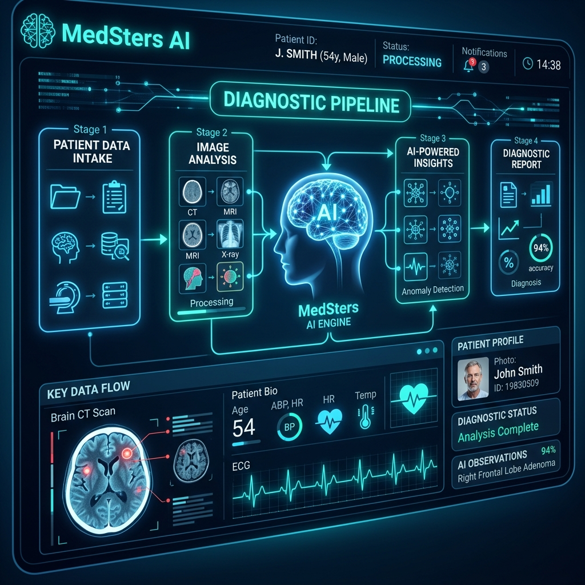
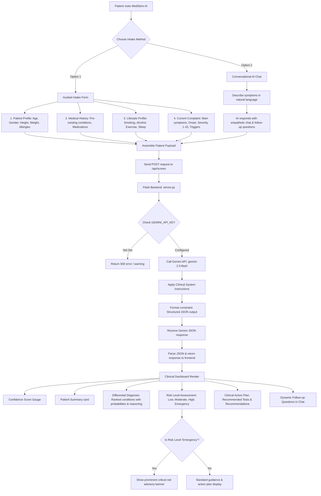

# MedSters AI - Clinical Health Screening Assistant

MedSters AI is an AI-powered health screening and clinical decision support assistant built as part of the Google AI Capstone Project. It enables patients to screen symptoms, receive differential assessments, and view structured medical guidance before consulting a health professional. 

Using **Gemini 2.5 Flash** (via the Google GenAI SDK), MedSters AI analyzes patient profile metadata, medical histories, lifestyle choices, and active complaints to generate structured diagnostic insights.

---

## 🌟 Key Features

1. **Guided Intake Form (Wizard):**
   - **Patient Profile:** Core statistics like age, gender, height, weight, and allergies.
   - **Medical History:** Background pre-existing conditions and current medications.
   - **Lifestyle Profile:** Core health contributors (exercise, sleep, smoking, and alcohol habits).
   - **Current Complaint:** Detailed logs of primary symptoms, pain severity rating (1-10), onset, duration, and triggers.

2. **Conversational AI Chat:**
   - Interactive, empathetic chat interface allowing natural language descriptions of symptoms.
   - Dynamically guided conversations using model-suggested follow-up questions.

3. **Clinical Dashboard & Insights:**
   - **Confidence Score:** Gauge indicating details completeness.
   - **Risk Assessment:** Emergency detection automatically flag-rating risk levels (Low, Moderate, High, Emergency).
   - **Differential Diagnosis:** List of ranked possible conditions with reasoning and probability percentages.
   - **Action Plan:** Recommended medical tests and clinical lifestyle/medical recommendations.
   - **Emergency Banner:** Immediate visual prompts to seek emergency care (911) if life-threatening indicators are present.

---

## 📸 Workflow & Architecture

Below is the design concept representation of the MedSters AI system:



### Core Operational Workflow



---

## 🛠️ Project Structure

```
MEDSTERS-AI/
├── assets/
│   └── medsters_workflow.png     # Visual system workflow image
├── static/
│   ├── app.js                    # UI logic, state management, and endpoint communication
│   ├── index.html                # Responsive clinical dashboard & intake wizard layout
│   └── style.css                 # Custom clinical theme & visual designs
├── .env                          # Local environment settings (GEMINI_API_KEY)
├── .gitignore                    # Prevents git tracking of environment keys & cache
├── requirements.txt              # Project Python dependencies
└── server.py                     # Flask server with Google GenAI SDK integration
```

---

## 🚀 Setup & Execution

### 📋 Prerequisites
- Python 3.10+
- A Gemini API Key from [Google AI Studio](https://aistudio.google.com/)
- GitHub CLI (if configuring deployment remotes)

### 💻 Installation

1. **Clone the Repository:**
   ```bash
   git clone https://github.com/badalsinghraghav/MEDSTERS-AI.git
   cd MEDSTERS-AI
   ```

2. **Install Dependencies:**
   ```bash
   pip install -r requirements.txt
   ```

3. **Configure Environment Variables:**
   Create a `.env` file in the root directory and add your Gemini API Key:
   ```env
   GEMINI_API_KEY="your-gemini-api-key-here"
   GOOGLE_GENAI_USE_ENTERPRISE="FALSE"
   ```

4. **Run the Flask Development Server:**
   ```bash
   python server.py
   ```
   The application will be running locally at `http://127.0.0.1:5000/`. Open this link in your web browser.

---

## 🛡️ Medical Disclaimer
MedSters AI is designed solely for informational, educational, and capstone demonstration purposes. It does not provide medical diagnoses, treatment plans, or definitive clinical decisions. Patients should always seek the advice of a qualified healthcare provider regarding any medical conditions.
